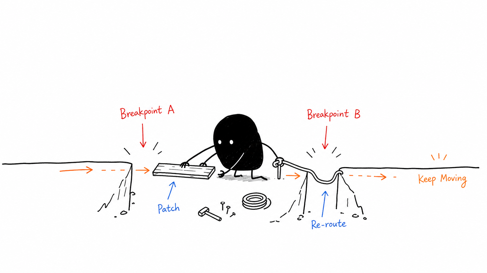

# Ian Xiaohei Illustrations

This repository is an English translation and adaptation of the original project by Ian. The original repository can be found at: [https://github.com/helloianneo/ian-xiaohei-illustrations](https://github.com/helloianneo/ian-xiaohei-illustrations).

> Turn the key judgments, workflows, states, and metaphors in an English article into a set of white-background, hand-drawn, weird-but-clean body illustrations.
>
> 16:9 horizontal | Xiaohei IP | pure white hand-drawn look | sparse red/orange/blue English annotations | Codex Skill

---

## What This Repo Is

Ian Xiaohei Illustrations is a Codex Skill that helps an AI agent generate body illustrations for English articles, posts, blogs, Notion docs, and method-driven content.

It is not a generic illustration prompt and it is not a PPT infographic template. The core workflow is: first understand the article's cognitive anchor points, then turn one judgment, workflow, structure, state, or metaphor into a memorable 16:9 hand-drawn explanation image.

The default visual IP is Xiaohei: a black solid character with white-dot eyes, thin legs, and a blank expression. Xiaohei is not a mascot, not a sticker, and not decoration in the corner. Xiaohei is a serious absurd worker who participates in the system.

In one sentence: **do not just "add a picture" to the article. Draw the key cognitive move the article is making.**

---

## Who It Is For

Good fit for:

- People writing English articles who need body illustrations and article art
- People making knowledge content, method content, and AI workflow content
- People who want abstract judgments turned into concrete metaphors
- People who want something lighter, stranger, and more personal than a PPT infographic
- People using Codex for content production and wanting a reusable visual language

Not a fit for:

- People who want commercial illustration, brand KV art, or polished flat design
- People who want traditional PPT infographics, complex architecture diagrams, or flowcharts
- People who want children's cartoons, cute IPs, or meme-style art
- People who want to cram long paragraphs, full explanations, or complete course pages into one image
- People who need strictly editable vector source files

---

## What It Produces

Default output:

- 16:9 horizontal body illustrations
- Shot lists for an article, usually 4-8 images
- For each image: topic, core idea, structure type, Xiaohei action, and English label suggestions
- Final PNGs saved under `assets/<article-slug>-illustrations/`

Default non-output:

- PPTX / PDF / Keynote
- SVG / HTML / Canvas editable files
- Commercial poster or cover art
- Dense text-heavy infographic pages

---

## Visual Style

This skill defaults to Ian's Xiaohei weird body-illustration style:

- Pure white background, no paper texture, no beige tint, no shadow, no gradient
- Black hand-drawn line art with thin, slightly wobbly lines
- Lots of empty space, with the subject taking about 40%-60% of the frame
- Sparse red, orange, and blue handwritten English annotations
- One image should express one core action, structure, state, or metaphor
- Xiaohei must be part of the core action, not just decoration
- Weird, creative, clean, but not childish or cute

---

## Example Images

### Two Breakpoints



### Sort by Purpose


### One Fish, Many Uses


### Handoff Path


### Information Well


### Idea Press


### Content Fermentation


### Trust Bridge


These images are style calibration samples, not composition templates. When you use the skill, invent a fresh metaphor from the current article instead of copying an old object arrangement.

---

## Installation

Clone the repo:

```bash
git clone https://github.com/tojileon/ian-xiaohei-illustrations-en.git
cd ian-xiaohei-illustrations-en
```

Copy the skill into your Codex skills directory:

```bash
mkdir -p "${CODEX_HOME:-$HOME/.codex}/skills"
cp -R ./ian-xiaohei-illustrations "${CODEX_HOME:-$HOME/.codex}/skills/"
```

After installing, use it in Codex like this:

```text
Use $ian-xiaohei-illustrations to design and generate 5 weird Xiaohei illustrations for this English article.
```

### Validate the Skill

Run the repository validator before publishing or copying a changed skill:

```bash
npm test
```

The validator checks the installable skill bundle, required reference files, local Markdown links, English-default text, synced example assets, PNG dimensions, and the generation/save contract.

### Versioning

Release versions are tracked in three places and must stay aligned:

- `package.json` for repository tooling.
- `ian-xiaohei-illustrations/VERSION` for the copied skill bundle.
- `CHANGELOG.md` for user-visible behavior changes.

Run `npm test` after changing any versioned behavior.

---

## How to Use It

### Planning only

```text
Use $ian-xiaohei-illustrations and do not generate images yet.
Please analyze where this article is worth illustrating and output a shot list of about 5 images.
For each image, explain:
- where it should go in the article
- the topic of the image
- the core meaning
- the structure type
- what Xiaohei is doing
- suggested elements
- suggested English labels

<paste article>
```

### Generate body illustrations directly

```text
Use $ian-xiaohei-illustrations and generate 4 Xiaohei body illustrations for the article below.
Requirements: 16:9 horizontal, pure white background, black hand-drawn line art, sparse red/orange/blue handwritten English annotations.

<paste article>
```

### Generate one image for one concept

```text
Use $ian-xiaohei-illustrations to generate one body illustration for:

Trust is not shouted into existence. It is laid down one piece of evidence at a time.

Make the image weird but clean, and make Xiaohei the core actor.
Keep the labels short and in English.
```

### Remove a title or wrong text from an image

```text
Use $ian-xiaohei-illustrations to edit this image and remove the top-left title "Flowchart". Keep everything else unchanged.
```

More examples are in [examples/prompts.md](examples/prompts.md).

---

## Workflow

The workflow is:

1. Read the article, Markdown file, Notion content, screenshot, or user theme
2. Identify the core ideas, cognitive pivots, workflows, and visualizable sections
3. Output a shot list first: each image should map to one cognitive anchor
4. For generation requests, produce a compact image spec table before calling `image_gen`
5. Pick one structure type per image: Workflow, system fragment, before-after contrast, character state, conceptual metaphor, layered method, route map, or small comic sequence
6. Re-invent a low-tech, weird-but-coherent physical metaphor
7. Make Xiaohei perform the core action
8. Generate each image separately
9. Check the QA checklist: white background, lots of space, Xiaohei action, English labels, no PPT feel, no old-case reuse
10. Save the final PNG with a slugged sequential filename and report the absolute path, purpose, and reliability

---

## Directory Structure

```text
.
├── README.md
├── CHANGELOG.md
├── package.json
├── scripts/
│   └── validate-skill.mjs
├── LICENSE
├── NOTICE.md
├── assets/
│   └── ian-wechat-qr.jpg
├── examples/
│   ├── images/
│   │   ├── 01-two-breakpoints.png
│   │   ├── 02-sort-by-purpose.png
│   │   └── ...
│   └── prompts.md
└── ian-xiaohei-illustrations/
    ├── SKILL.md
    ├── VERSION
    ├── agents/
    │   └── openai.yaml
    ├── assets/
    │   └── examples/
    └── references/
        ├── style-dna.md
        ├── xiaohei-ip.md
        ├── composition-patterns.md
        ├── prompt-template.md
        └── qa-checklist.md
```

The only part that needs to be installed into Codex is the subdirectory:

```text
ian-xiaohei-illustrations/
```

The top-level README, LICENSE, NOTICE, and examples are GitHub-facing documentation.

---

## Notes

- Keep the handwritten labels short.
- One image should only explain one structure.
- Xiaohei must be part of the core action; if the image still works perfectly without Xiaohei, Xiaohei is too decorative.
- The sample images are for checking line density, whitespace, color restraint, and Xiaohei participation. Do not copy their composition.
- Image models can produce typos, hallucinated labels, style drift, or extra titles. Always check the output.
- If the labels are wrong, reduce the number of labels and regenerate.
- If you want another language, ask for it explicitly.

---

## Related Projects

- [Ian Handdrawn PPT](https://github.com/helloianneo/ian-handdrawn-ppt) - hand-drawn technical PPT-style page generator skill
- [Awesome Claude Code Skills](https://github.com/helloianneo/awesome-claude-code-skills) - curated collection of Claude Code skills, agents, and plugins
- [Obsidian + Claude AI Second Brain](https://github.com/helloianneo/obsidian-ai-second-brain) - guide to building a personal knowledge base with Obsidian and Claude AI

---

## About the Author

**Ian** - product designer / solo founder builder / AI builder

Using AI to build a one-person company.

- GitHub: [helloianneo](https://github.com/helloianneo)
- X/Twitter: [@ianneo_ai](https://x.com/ianneo_ai)
- Website: [www.ianneo.xyz](https://www.ianneo.xyz)
- WeChat: `ianneoxyz`
- Email: hello.neoc@gmail.com
